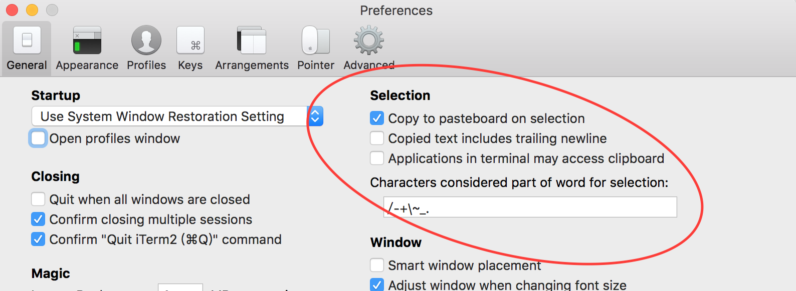

# clipboard剪贴板说明

# 机器自身管理程序.

mac 下是 `pbcopy` `pbpaste`

X window下的linux可用 `xclip`,给大部分应用程序提供ctrl+c ctrl+v支持. 直接在远程终端运行会报`Error: Can't open display:`因为没有X窗口程序.

无桌面的(终端下的)linux可用`gpm`,提供鼠标支持(mac终端,iterm2都有 而且iterm2的还很强大)

vim中自身有各种寄存器, `"+` `"*`对应系统剪贴板

tmux也是有自己内部的buffer

终端也有关于复制粘贴的配置,iterm2 默认支持鼠标选中复制;在edit里有类似vim的copy mode.

applications in terminal may access clipboard 为true的话 tmux(>2.3)默认的复制就会到本地了

## 写在前面的总结
注意计算机发展的历史,从CLI到GUI,从键盘到鼠标出现.

所以现在程序 一般都有鼠标复制和键盘复制两种功能. 
而鼠标复制在终端环境下,有覆盖的功能.所以会导致一些问题.

## 当前决定配置

vim 鼠标不开
tmux 鼠标配置快捷键 `前缀+m`开关鼠标功能. 需要要tmux的滚动 但是iterm2 的smart choose也很不错(双击词 三击行 四击默认段 复制终端长字符串特别方便 )

iterm2 applications in terminal may access clipboard打开

根据情况使用`ssh -X`和`ssh -R`

# iterm2 vim tmux 间 鼠标复制 command+V粘贴

1. 无论是不是用tmux
command+V 也可以从本地粘贴到远程上. 但是注意这相当于逐个键盘字符输入. 粘到vim里要么最好在paste模式

2. 不使用tmux时

即便ssh等到远程机,直接鼠标选中(**使用的终端的鼠标复制功能**)即可复制内容到本地机器的剪贴板. command+V好使

3. 使用tmux(开启鼠标功能)

由于tmux自身有剪贴板,开启鼠标功能,鼠标选中的复制到tmux的buff里了.(**tmux的鼠标功能呢导致终端的鼠标功能不好使,z轴覆盖问题**)

可以手动把内容传递到本地
mac本地的话可以直接`tmux save-buffer - | pbcopy`
如果是在远程机器上的tmux,原理也是一样`tmux save-buffer - | ssh local pbcopy`.
但是一般本地机的IP是不固定的,而且未必好访问(从公司的服务器访问本地机). 可以用`ssh -R`开启远程转发解决.

iterm2 设置genaral-applications in terminal may access clipboard 打开
那么tmux大于2.3的版本就不会往自己的buffer里存了.

直接把tmux的buffer的内容弄到vim的寄存器里面 或者vim中的内容弄另一个窗口的命令行????

除了用本地中转外还有就是选择是通过远程机系统剪贴板(对应vim寄存器)
终端下 缺少DISPLAY无法访问xclip. 所以无法通过远程主机的剪贴板中转.可以使用`ssh -X`X11Forwarding见后

# 使用tmux时,使用终端的滚动或选择
tmux开启鼠标功能后,复制用的tmux的.但是将鼠标移到右边滚动条,可用iterm2的滚动功能.但是没有意义往上发现是进入tmux之前的页面.
同样iterm2的copy mode 可用但是无法复制超过终端平面的数据,是进入tmux之前的页面.

只能使用tmux的鼠标滚动或者copy模式.

所以我的方法是tmux的鼠标默认关闭,设置快捷键

# X11Fforwarding 通过xclip 复制内容到本地.
我的理解就是把运行在服务器上的需要X-window程序,可以使其借用本地的X-window运行.

首先窗口程序要都是X-window才行, linux间问题应该不大.

不过mac连linux,google[在mac osx安装XQuartz并配置x11 forwarding](https://www.birdcat.cn/%E5%B8%B8%E7%94%A8%E6%8A%80%E5%B7%A7/enable-x11-forward-in-osx.html)

说明:
[XQuartz](https://www.xquartz.org/) 一个提供运行在OSX上X-window的项目
可以下载dmg,但这里我用`brew install caskroom/cask/xquartz`
另外,我没有修改服务端sshd配置(一般也不能改),默认`X11Forwarding yes`是有的

`ssh -X`本地`ForwardX11 yes`加入`~/.ssh/config`持久化.
`xclock xeyes`是一些用来测试的小程序  

问题: `-vvv` 发现`X11 forwarding requested but DISPLAY not set`
本地(登之前)DISPLAY变量未设置. 这个变量应该会被xquartz自动设置才对.最后发现是终端没有彻底退出的原因

## xclip
一个使用x-window的剪贴板程序
`xclip -sel clip`表示使用系统剪贴板,默认是其内置剪贴板
所以一般`alias xclip="xclip -sel clip"`
`xclip -o`输出剪贴板内容
更多用法见man文档

然后现在远程机器情况下 vim复制到`"+`寄存器 本地就可以command+v了

### `ssh -R`
本质上是`echo '要复制的内容' | ssh local pbcopy`.需要配密钥登录 加`-R`只是为了固定地址而已

`ssh -R 1234:localhost:22 remoteServer` remoteServer上开启1234端口, 发送到1234的数据会被**转发**到localhost(本地机器)的22端口(ssh服务端口)
`tmux save-buffer - | ssh -p 1234 localhost pbcopy` 通过1234端口连接本地的ssh服务
`bind C-c run "tmux save-buffer - | ssh -p 1234 localhost pbcopy"`
基于`tmux save-buffer - | ssh host pbcopy`
需要开启mac的ssh.系统偏好设置-共享. 还需要配置密钥登录 和一些安全选项.
PS:配置可用alias和~/.ssh/config简化

`ssh -R` 远程转发  简单的说就是在登录的机器上开启一个指定的端口,所有发送到这个端口的数据会自动转发到host:hostport这个地址中.
man文档
-R [bind_address:]port:host:hostport
>Specifies that the given port on the remote (server) host is to be forwarded to the given host and port on the local side.  This works by allocating a
 socket to listen to port on the remote side, and whenever a connection is made to this port, the connection is forwarded over the secure channel, and a
 connection is made to host port hostport from the local machine.

>Port forwardings can also be specified in the configuration file.  Privileged ports can be forwarded only when logging in as root on the remote machine.
 IPv6 addresses can be specified by enclosing the address in square braces.

> By default, the listening socket on the server will be bound to the loopback interface only.  This may be overridden by specifying a bind_address.  An
 empty bind_address, or the address ‘*’, indicates that the remote socket should listen on all interfaces.  Specifying a remote bind_address will only
 succeed if the server's GatewayPorts option is enabled (see sshd_config(5)).

>If the port argument is ‘0’, the listen port will be dynamically allocated on the server and reported to the client at run time.  When used together
 with -O forward the allocated port will be printed to the standard output.

